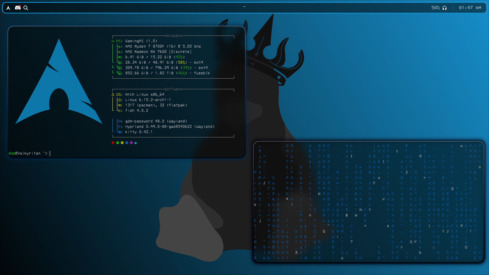
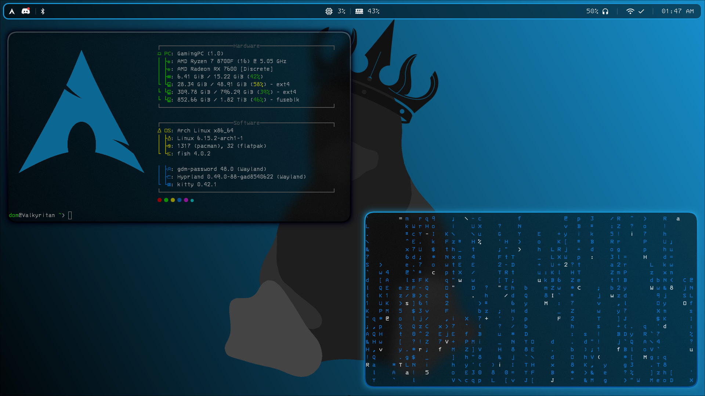

# Welcome to my dotfiles repo!
## Nothing here but pure ricing... that doesn't look that good.
### Main Screen Config


### Secondary Screen Config



## Required dependencies:
### Required (pacman)
- `kitty` - terminal emulator
- `hyprland` - window manager
- `fish` - shell
- `rofi` - application launcher
- `waybar` - status bar
- `git` - used to clone this repository
- `sudo` - used for privilege elevation

### Optional (but recommended)
- `fastfetch` - system info (cool aesthetic)
- `hyprpaper` - wallpaper manager, maintained under the AUR
- `hyprshot` - screenshot tool, maintained under the AUR

# THIS SECTION IS FOR THE MANUAL INSTALLATION (RECOMMENDED)
## How to install:
### Step 1: Download this repository
This should be *pretty* straightforward, but you actually have to download this to use it.

### GUI-based download
Scroll up, click the green `<> Code ▼` button, then click `Download ZIP`, which automatically sends this to your Downloads folder if you have one.

### CLI-based download
For this, you need `git`, which the command to install is:
```bash
sudo pacman -S git
```
This command assumes you use `sudo` as your privilege escalation tool.

Then after that is installed, you need to clone the repository into a directory.
I personally have my own `git` folder inside my `/home` directory for things like that to keep it clean, but you can do whatever you like.
```bash
git clone https://www.github.com/domara-root/hyprland-dotfiles
```

### Step 2: Move the config files to your config folder
Pretty sure you may know how to do this, but if you don't, here's how:
```bash
cp -r hypr "$HOME/.config"
cp -r rofi "$HOME/.config"
cp -r kitty "$HOME/.config"
cp -r waybar "$HOME/.config"
cp -r fastfetch "$HOME/.config"
```
Then copy the logo.png to fastfetch config, which is optional but extremely recommended
```bash
cp logo.png $HOME/.config/fastfetch/logo.png
```
Then copy the wallpaper to the working directory (which can be changed), once again optional.
```bash
mkdir $HOME/.dotfiles
cp wallpaper.png $HOME/.dotfiles/wallpaper.png
```

# THIS SECTION IS FOR ARCH-BASED SYSTEMS ONLY!! THIS IS THE AUTOMATIC INSTALLER.
**WARNING ⚠️:** Right now, the only stable usage of this script is on Arch-based or Fedora-based OSes, like Manjaro, EndeavourOS, Nobara, etc. If you do not have an Arch-based or Fedora-based OS, **PLEASE DO NOT USE THIS!!**
If you DO have an Arch-based OS and you want to help test it, you are more than welcome to use this script and give feedback! 🙂
## How to install:
### Step 1: Make the install.sh file executable
To actually run the installer, you need to mod it so it can actually run.
```bash
chmod +x install.sh
```

### Step 2: Run the install script
After chmodding the file, you need to run it.
```bash
./install.sh
```
It will then prompt you if you want to install this in case you are unsure and would like to change your mind. To continue, type `Y` (or `y`) and press enter.

After that's done, it's recommended to log out and log back in to refresh any apps with configs (aka, just waybar).
There's an instructions file in `/home/your-user/instructions.txt` for keybinds and such.

<small>its 1:56 AM i am so tireddd</small>
